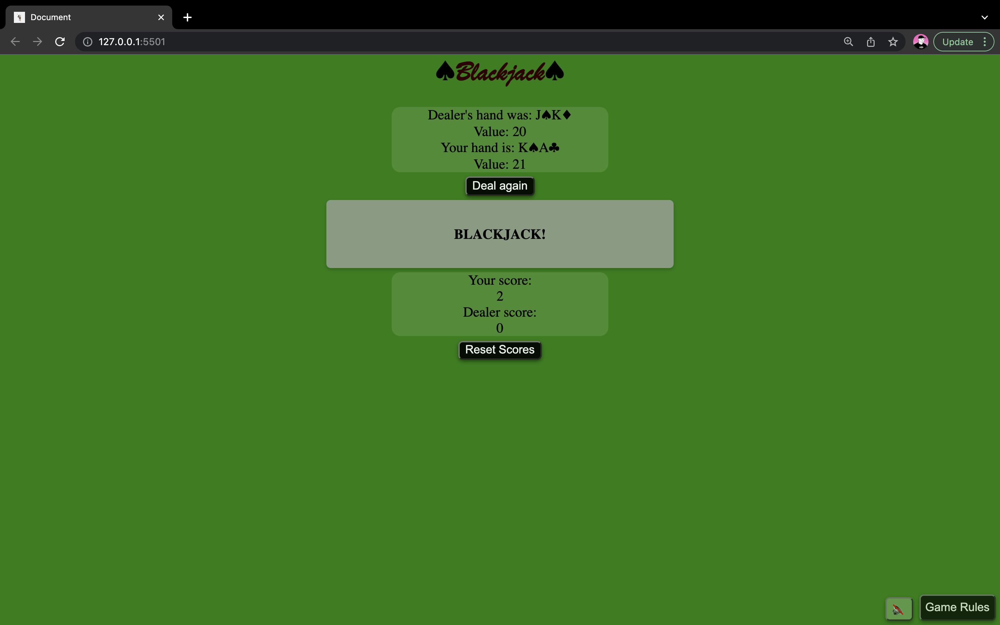

<h1> 21 (Blackjack) by Ronnie Rogers</h1>

-Welcome to my very first ever project! I built this game during my first month of my Software Engineering Immersive course.

-I did not initially set out to make this game text based, but it turned out to be a bit more time consuming than I initially anticipated. So, for the time being, the game will be text based with visual cards added later on.

-I chose to create a web based Blackjack game because Blackjack is my personal favorite casino game and I'm already familiar with how it is played.

<b>Here's some shots of the game in action</b>

-Technologies used in this project were Javascript, CSS, and HTML5.  I wanted to keep my first project simple.

<b>Try it for yourself!</b> 
 
https://ronniexrogers.github.io/
 
-It is player vs dealer (dealer is automated). 
 
-The goal is to get your cards total value as close to 21 as you can without going over. If you'd like another card, click "Hit me!" But, be careful. You do not want your cards' total value to be greater than 21.  If it is, you lose!
 
-"J", "Q", "K" have a value of 10.  "A" have a value of 11.
 
-If you do not want anymore cards, press "Stand." Once you stand, the dealer will reveal their cards.  If the dealer's initial hand is less than 17, they must keep drawing cards until their total value is 17 or greater. 
 
-Whosever cards' value is greater wins and scores one point!
 
-A tie results in a push in which neither wins or loses.
 
-If your initial hand is equal to 21 you automatically win and score two points!

-I had a lot of fun coding my first game and playing around with this project.

<b>Future features that I will be adding in the future include:</b>
 
-Visual cards displayed rather than having the text value of the cards displayed
 
-A betting system that will take place over the score system
 
-Greater visual effects, especially when it comes time to display physical cards
 
-Ability to add multiple players and play locally

